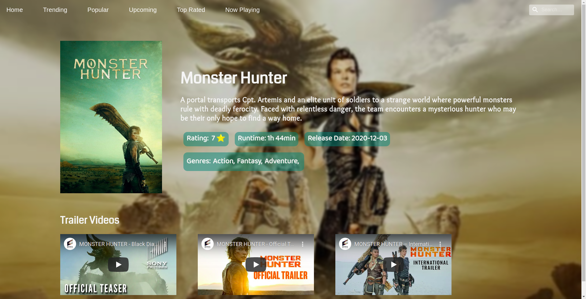
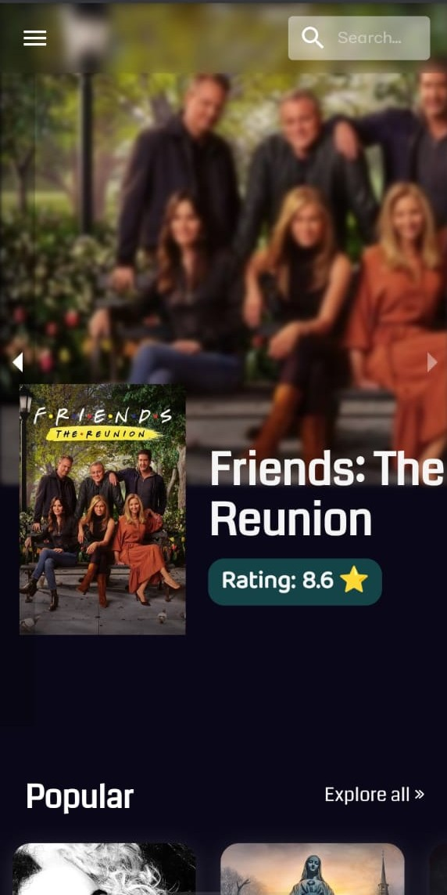
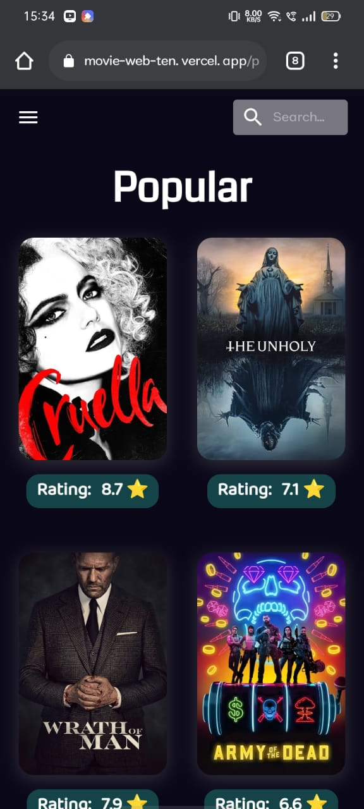

# MOVIE APP

## FRONTEND


<p>
                                    
 </p>

## Description

A movie surfing application using tmdb api.

## Features

- Has a list of popular, upcoming, trending, now playing and top rated movies
- Can watch trailer videos
- Has details of all the movies including release date and runtime.
- Search option for wide range of Movies search

## Visit At

https://movie-web-ten.vercel.app/.

## Installation and Usage

- Clone this repository
- Install all the dependencies by running this command

```
npm install
```

- create .env file and fill it up with required values from .env.example

- Replace <Enter your api key here> in the .env with the api key generated from [tmdb site](https://www.themoviedb.org/settings/apis).

- Run the development Server

```
npm start
```

# Application is dockerized

- Run the docker image by running this command

```
docker run shruti3105/movie-web
```

- To Run the docker image on your local host, run this command

```
docker run -p 3000:3000 shruti3105/movie-web
```

- To build docker compose, run this command

```
docker-compose up -d --build
```
